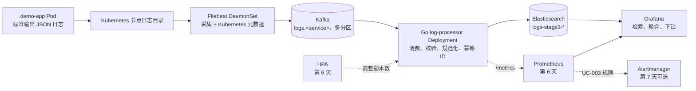

# 项目三：分布式可扩展日志分析平台开发与 Codex 协作指南

> 文档状态：阶段三启动基线
> 制定日期：2026-07-30
> 建议周期：7 天；最短 5 天完成核心用例
> 开发方式：用例驱动、文档驱动、精简 Git 分支流、测试随实现提交
> 依据：外部资料《武大雷军班校企联合培养——云原生研发工程师岗位》第 11～15 页

## 0. 先看结论

这一阶段不应一开始就同时搭 Kafka、Elasticsearch、Grafana、Prometheus、告警和 AI。正确顺序是按用户可验证的纵向用例，一次打通一小段：

1. **UC-001 必做**：Pod 日志 → Filebeat DaemonSet → 按服务划分的 Kafka 主题 → Go 日志处理服务 → Elasticsearch。
2. **UC-002 必做**：Elasticsearch → Grafana 全文检索、聚合图表和下钻。
3. **工程加固**：Prometheus、资源限制、HPA、故障恢复和性能证据。
4. **UC-003 选做**：日志异常告警。
5. **UC-004 不纳入本轮编码**：AI 异常检测需要训练数据、基线模型和独立评测，强塞进 7 天只会得到无法证明准确率的演示代码。

推荐按 7 天执行。若只有 5 天，在第五天交付 `v0.1.0`，它必须真实完成 UC-001、UC-002；第 6～7 天作为 `v0.2.0` 加固迭代。任何核心链路未通过时，后续天数优先修复核心，不开始选做项。

## 1. 原文要求与本次落地解释

### 1.1 原文硬要求

- Go 1.22+ 开发微服务。
- Kubernetes 中以 Filebeat DaemonSet 采集 Pod 日志并补充 `namespace`、`pod_name`、`service_name` 等标签。
- 日志先进入 Kafka，再写入 Elasticsearch。
- Grafana 支持时间范围、服务和关键词查询，并展示日志级别占比、异常趋势和详情。
- UC-001、UC-002 必做；UC-003、UC-004 选做。
- 最终应有架构设计、Kubernetes 部署手册、性能测试报告、复盘报告和完整测试。
- 代码托管在 GitHub，采用 Git 分支流。

### 1.2 原文中需要补全的设计

原文写明 Filebeat 把日志送入 Kafka、最终写入 Elasticsearch，但没有明确谁消费 Kafka。本项目增加一个精简的 Go 服务 `log-processor`：

```text
Kafka logs.<service>
  → log-processor 消费、校验、规范化、生成 event_id
  → Elasticsearch 幂等写入
```

这不是额外扩张，而是让 UC-001 的链路真正闭合，也让 Go 分布式服务开发成为阶段核心。

UC-002 中的 Go 查询中间层是原文的可选步骤。为了保持代码精简，`v0.1.0` 让 Grafana 直接查询 Elasticsearch，不重复实现一套查询接口。只有出现权限隔离、跨索引聚合或稳定外部接口的明确需求时，才新增查询服务。

### 1.3 对量化验收的诚实解释

| 原文指标 | 本机 5～7 天可验证的版本 | 不作出的过度承诺 |
|---|---|---|
| 无丢失、无重复 | 在固定数据集、固定缓冲容量和明确故障窗口内，输入数=最终唯一文档数；重复投递不产生重复文档 | 不宣称任意故障、无限断网和磁盘耗尽时仍绝对无丢失 |
| 采集到可视化延迟 ≤3 秒 | 记录指定测试规模下的 p50、p95、p99 和环境信息，目标 p95≤3 秒 | 不用单次截图代替统计结果 |
| 每秒 1000+ 条 | 在本机固定资源和固定日志大小下做可复现实验，报告达到值与瓶颈 | 不把单节点 Minikube 结果外推为生产容量 |
| 高可用 | 验证 Pod 重建、消费者重启、短时 Kafka 不可用后的恢复 | 单节点 Minikube 不能证明节点级或多可用区高可用 |
| HPA | 对可横向扩展的 `log-processor` Deployment 验证扩缩容 | Filebeat 是 DaemonSet，不对它配置 HPA |

Filebeat 的投递语义是“至少一次”，发生未确认重试时可能产生重复。因此系统应依靠稳定 `event_id` 和 Elasticsearch 文档 `_id` 实现幂等，而不能把“没有观察到重复”当成设计保证。

## 2. 已确认的本机基线

2026-07-30 的只读环境检查结果如下：

| 项目 | 已确认状态 |
|---|---|
| WSL | 2.7.10.0；默认发行版 `Ubuntu-24.04`；WSL 2 |
| Linux | Ubuntu 24.04.4 LTS |
| Go | 1.26.5，满足文档的 1.22+；路径 `/usr/local/go/bin/go` |
| Docker | 29.6.2，客户端和服务端可用 |
| Docker Compose | v5.3.1 |
| kubectl | v1.36.3 |
| Kustomize | v5.8.1，随 kubectl 可用 |
| Minikube | v1.38.1；计划为阶段三创建独立的 `stage3-logs` 配置档 |
| Kubernetes | `stage3-logs` 配置档尚未创建；创建前没有阶段三可用集群 |
| 容器运行时 | containerd 2.2.1 |
| Git | WSL 2.43.0；Windows 2.55.0 |
| GitHub CLI | Windows 有 2.96.0；WSL 中未安装 |
| 暂缺工具 | WSL 中未发现 Helm、kind、k3d、gh |
| Windows 物理资源 | 15.6 GiB 内存；20 个逻辑处理器 |
| WSL 可见资源 | 7.6 GiB 内存、2 GiB swap、20 个逻辑处理器；磁盘空间充足 |
| Metrics Server | 尚未安装，当前不能使用 `kubectl top` 或 CPU 型 HPA |

注意事项：

- Go 目前在登录终端中可见，但非登录终端可能找不到。若集成开发环境或脚本报告 `go: command not found`，先检查终端配置，不要重复安装 Go。
- `D:\codesource\go2` 下虽然有一个空 `.git` 目录，但它不是有效仓库；这个目录还包含其他学习目录和多份文档，不应直接初始化成项目三仓库。
- 项目三直接创建独立的 `stage3-logs`，初始分配 4 CPU 和 6 GiB 内存。
- 项目三应建立独立仓库。为了 WSL 文件 I/O、权限和符号链接更稳定，推荐放在 Linux 文件系统：

```text
~/projects/distributed-log-platform
```

Windows 可通过下列路径访问：

```text
\\wsl$\Ubuntu-24.04\home\<你的Linux用户名>\projects\distributed-log-platform
```

本指南当前保存在 Windows 工作区。第 1 天建仓后，把它复制为新仓库中的 `docs/PLAN.md`。

### 2.1 第 1 天容量门禁

完整栈启动前必须创建并验证独立的阶段三集群。

**本轮已选方案**

- 新建 `stage3-logs` 配置档，初始使用 4 个处理器、6 GiB 内存、Docker 驱动和 containerd 运行时。
- Kafka 和 Elasticsearch 使用开发级小内存堆、单副本和短数据保留。
- 用户已确认创建 `stage3-logs`；执行时先展示精确命令，但不需要再次询问这项操作。

建议创建命令：

```bash
minikube start -p stage3-logs \
  --driver=docker \
  --container-runtime=containerd \
  --cpus=4 \
  --memory=6144
```

**资源不足时的升级方案**

- WSL 可用 10～12 GiB，`stage3-logs` Minikube 分配 8 GiB。
- 这更适合第 6 天同时运行 Prometheus 和压测。
- 只有出现内存不足、频繁重启或第 6 天资源不足的实际证据后，再讨论修改 `.wslconfig` 和重建或调整配置档。

**创建后的硬验证**

- `minikube profile list` 中的 `stage3-logs` 为运行状态。
- `kubectl config current-context` 为 `stage3-logs`。
- `kubectl get nodes` 显示新节点已就绪。
- Docker 外层容器内存限制约为 6 GiB。

本次授权只覆盖创建 `stage3-logs`。修改 `.wslconfig`、关闭 WSL、删除或重配任何配置档，以及删除或重建 `stage3-logs`，仍需另行确认。创建后要同时检查 WSL 可见内存、Minikube 外层容器限制和 Kubernetes 节点状态，不能只相信配置档文件。

## 3. 范围基线

### 3.1 `v0.1.0` 必做

- 一个输出结构化 JSON 日志的 `demo-app`。
- Filebeat 以 DaemonSet 运行，采集目标 Pod 日志并添加 Kubernetes 元数据。
- Kafka 单节点开发配置，按服务创建 `logs.<service>` 主题；同一个演示镜像以两个服务名部署即可验证路由。
- Go `log-processor` 消费 Kafka，规范化事件并幂等写入 Elasticsearch。
- Elasticsearch 保存可全文检索、可按时间/服务/级别聚合的日志。
- Grafana 数据源和仪表盘通过仓库文件自动配置。
- 单元测试、组件集成测试和一条可重复执行的端到端冒烟测试。
- 从空命名空间部署、验收、清理的文档和命令。
- GitHub 仓库、PR 记录、规范提交和 `v0.1.0` 标签。

### 3.2 `v0.2.0` 推荐加固

- `log-processor` 暴露 Prometheus 指标。
- Prometheus 采集平台核心指标，Grafana 增加平台健康仪表盘。
- `log-processor` 配置资源请求与上限和处理器型 HPA。
- Kafka 主题使用多个分区，并验证消费者副本扩展。
- 故障注入、重试、幂等、延迟和吞吐报告。
- 时间允许时完成 UC-003 的本地告警闭环。

### 3.3 本轮明确不做

- UC-004 PyTorch 异常检测。
- 多租户、基于角色的访问控制用户系统、跨集群采集和生产级 TLS/证书体系。
- 自研网页前端。
- 同时保留 Grafana 查询和重复的 Go 查询接口。
- 为“以后也许需要”提前引入微服务框架、依赖注入框架或复杂领域层。
- 生产级多节点 Kafka/Elasticsearch 高可用集群。

## 4. 推荐架构



### 4.1 组件职责

| 组件 | 唯一职责 | 不承担的职责 |
|---|---|---|
| `demo-app` | 产生可预测、可编号的结构化日志 | 不直接写 Kafka 或 Elasticsearch |
| Filebeat | 采集节点上的容器日志，补充 K8s 元数据，发送 Kafka | 不做业务聚合，不直接写 ES |
| Kafka | 按服务主题解耦采集与处理，提供短时缓冲和重放基础 | 不负责长期检索 |
| `log-processor` | 消费、校验、规范化、幂等标识、写 Elasticsearch | `v0.1.0` 不提供通用查询接口 |
| Elasticsearch | 索引、全文检索、聚合 | 不作为消息队列 |
| Grafana | 查询、可视化、下钻 | 不保存日志主数据 |
| Prometheus | 第 6 天采集平台指标 | 不采集日志正文 |

### 4.2 最小日志契约

日志字段从项目三用例和查询需求出发，并尽量采用 Elastic Common Schema 的通用命名：

```json
{
  "@timestamp": "2026-07-30T12:00:00Z",
  "event_id": "sha256:...",
  "message": "数据库连接失败",
  "log.level": "ERROR",
  "service.name": "demo-app",
  "test_run_id": "e2e-20260730-001",
  "kubernetes.namespace": "stage3",
  "kubernetes.pod.name": "demo-app-...",
  "kubernetes.pod.uid": "...",
  "container.id": "...",
  "log.file.path": "/var/log/containers/...",
  "log.offset": 12345,
  "ingested_at": "2026-07-30T12:00:01Z"
}
```

字段命名优先向 Elastic Common Schema 靠拢，但本轮只保留验收确实会使用的字段。

`test_run_id` 仅用于可重复验收和性能实验：每次冒烟或性能测试生成一个唯一值，使我们能证明同一批探针事件确实穿过了整条链路，而不是误查到上一次残留数据。生产日志没有该字段时允许为空。

### 4.3 幂等与确认边界

推荐的 `event_id` 候选输入：

```text
kubernetes.pod.uid
container.id
log.file.path
log.offset
@timestamp
message
```

处理规则：

1. 对字段做稳定排序与明确分隔后计算 SHA-256。
2. 以 `event_id` 作为 Elasticsearch 文档 `_id`；优先使用批量 `create` 动作，把 HTTP 409 视为“已存在的重复事件”并计数，而不是系统失败。
3. Elasticsearch 写入成功后，才确认对应 Kafka 消息。
4. 可重试的 Elasticsearch 错误不确认位点，按有上限的指数退避重试。
5. 无法解析的毒消息不能永久阻塞分区；最简方案是写入 `logs.dlq` 后确认，或在 ADR 中明确采用的替代策略。
6. 测试必须证明同一事件重复投递后只有一份最终文档。

## 5. 精简仓库结构

第 1 天先建立最少目录；对应功能开始前不要创建空包：

```text
distributed-log-platform/
├── AGENTS.md
├── README.md
├── Makefile
├── go.mod
├── cmd/
│   ├── demo-app/
│   │   └── main.go
│   └── log-processor/
│       └── main.go
├── internal/
│   ├── event/
│   ├── pipeline/
│   └── store/
├── deploy/
│   ├── base/
│   └── overlays/
│       └── local/
├── dashboards/
├── scripts/
│   ├── smoke.sh
│   └── verify-recovery.sh
├── docs/
│   ├── PLAN.md
│   ├── PROJECT_STATE.md
│   ├── requirements.md
│   ├── architecture.md
│   ├── deployment.md
│   ├── test-report.md
│   ├── performance-report.md
│   ├── retrospective.md
│   └── adr/
└── .github/
    └── workflows/
        └── ci.yml
```

### 5.1 Go 代码约束

- 2026-07-30 项目覆盖决定：用户明确选择 Go 1.26.5 作为开发、`go.mod` 与持续集成的统一版本；该决定取代本指南早期“模块优先保持 Go 1.22”的建议。
- 持续集成至少验证仓库声明的最低 Go 版本；条件允许时再加当前本机版本，不用“本机能编译”代替最低版本验证。
- 使用 `log/slog`，不再引入另一个日志库。
- HTTP 仅用于健康检查和指标时优先使用 `net/http`，不为两个端点引入 Gin/Echo。
- 只在 Kafka 与 Elasticsearch 这样的外部边界定义小接口；不要把每个结构体都抽象成接口。
- 手写很小的测试替身，不引入模拟对象生成框架。
- 配置来自环境变量；启动时一次校验，缺少必填配置立即失败。
- 所有后台循环接收 `context.Context`，支持 `SIGTERM` 优雅退出。
- 错误在能增加语义时用 `%w` 包装；同一错误不在每层重复打印。
- 测试和实现一起提交，优先表驱动测试。
- 第二个真实调用方出现前，不创建“通用工具包”。
- 不使用 `utils`、`common`、`manager` 这类含义不清的包名。
- 不追求注释数量；公开行为、非显然约束和为什么这样设计才写注释。

### 5.2 Kubernetes 约束

- 使用 Minikube，不额外引入 kind、k3d 或 Helm；完整栈优先放入独立 `stage3-logs` 配置档。
- 创建和切换 `stage3-logs` 上下文前后都要显式检查当前上下文。
- 使用 Kustomize 管理本地 overlay；镜像与关键依赖必须固定版本，禁止 `latest`。
- 所有对象放在独立命名空间，例如 `stage3-logs`。
- ConfigMap 只放非敏感配置；Secret 不提交真实值。
- 所有自研 Deployment 配置就绪探针、存活探针、资源请求与上限和优雅终止时间。
- Filebeat 只采集目标命名空间或工作负载，显式排除自身和基础设施日志，防止递归采集。
- Kafka、Elasticsearch、Grafana 在本机均采用单节点开发配置；文档中明确它们不是生产拓扑。
- 基础设施 Service 默认使用 `ClusterIP`，本机查看界面优先临时 `kubectl port-forward`；不为了演示把 Kafka、ES 或 Grafana 暴露到公网。
- 若开发环境为降低资源关闭 Elasticsearch 安全功能，必须标注“仅限隔离的本机集群”，不能把该配置描述成部署最佳实践。

### 5.3 独立实现原则

项目三不依赖项目二代码、提交历史或目录结构，按全新的独立仓库开发：

- 需求、日志契约、主题、索引和测试都以项目三的 UC-001、UC-002 为唯一依据。
- 不安排旧项目代码扫描、复制或迁移任务。
- 所有 Go 类型、配置加载、健康检查、事件规范化和幂等逻辑均在新仓库中按当前用例从零实现。
- 先写当前行为和失败测试，再写最小实现；不预建完整的“处理器 → 服务 → 仓储”分层。
- 可以继续采用表驱动测试、标准库优先、小提交等通用工程方法，但它们不构成对旧项目代码的依赖。
- 新仓库拥有独立的 `go.mod`、Git 历史、持续集成、部署配置和文档，不引用工作区中的其他工程目录。

## 6. 用例驱动的工作方法

每个用例都按同一条闭环执行：

```text
澄清用例
→ 写“前提/当/则”验收场景
→ 画最短数据路径
→ 先写能失败的测试或验收脚本
→ 实现最小代码
→ 本地快速验证
→ 集群端到端验证
→ 故障场景
→ 更新文档和 PROJECT_STATE
→ 小提交与 PR
```

任何一天都不允许只以“YAML 写完”“Pod 是 Running”或“页面能打开”作为完成。完成必须对应可复现的输入、输出与验证命令。

## 7. 七天计划

每天建议 6～8 小时。上午先学原理并完成最小切片；下午打通真实链路；最后 30～45 分钟只做测试、提交和状态记录。

### 第 1 天：范围、仓库、架构和最小工程骨架

**学习重点**

- WSL 文件系统与 Windows 挂载目录的差异。
- Git 本地仓库、远端仓库、分支和 PR 的关系。
- Kafka 在链路中的解耦作用。
- Kubernetes Deployment、DaemonSet、StatefulSet/单节点开发实例的职责差异。

**当天任务**

1. 在 WSL 的 `~/projects/distributed-log-platform` 新建独立目录。
2. 检查 Go 路径、Docker、kubectl 上下文、Minikube 节点和可用资源。
3. 按第 2.1 节创建 `stage3-logs`，验证新上下文、节点状态和 6 GiB 外层内存限制。
4. 按第 5.3 节确认独立实现边界，不扫描或迁移其他项目代码。
5. 从本指南提炼并提交：
   - `docs/requirements.md`
   - `docs/architecture.md`
   - `docs/adr/ADR-001-pipeline.md`
   - `docs/adr/ADR-002-delivery-and-idempotency.md`
6. 初始化 Go 模块，只建立 `cmd/demo-app` 的最小可运行程序和测试。
7. 建立 `Makefile` 的真实命令入口：`fmt`、`vet`、`test`、`build`；不存在的集群命令先不伪造。
8. 建立最小 Go 持续集成，只执行格式检查、`go vet` 和单元测试；暂不把重型 Kubernetes 集成环境塞入持续集成。
9. 建立 `.gitignore`、README 骨架、`AGENTS.md` 和 `docs/PROJECT_STATE.md`。
10. 本地首个提交后，再创建 GitHub 私有仓库并配置远端；确认凭据后推送。
11. 建立 `develop`，后续功能从 `develop` 开分支。
12. 固定版本矩阵。先做兼容性验证，再把实际镜像版本写入架构文档；禁止凭记忆选“最新版本”。

**建议分支与提交**

```text
main
└── develop
    └── feature/bootstrap

chore: 初始化阶段三仓库
docs: 定义用例与架构基线
feat(demo): 添加最小结构化日志生成器
test(demo): 验证确定性事件输出
```

**当天退出条件**

- GitHub 远端可访问，`main` 与 `develop` 已推送。
- `go test ./...`、`go vet ./...`、格式检查通过。
- 阶段三目标上下文已明确，`kubectl get nodes` 显示节点已就绪，Minikube 外层内存限制达到选定值。
- 架构图能明确回答“Kafka 到 ES 由谁处理”。
- `PROJECT_STATE.md` 写明第 2 天的唯一第一步。

**当天不要做**

- 不部署 Grafana、Prometheus 或告警。
- 不一次性生成所有 Kubernetes YAML。
- 不在 `D:\codesource\go2` 根目录执行 `git init`。

### 第 2 天：UC-001A——Pod 日志进入 Kafka

**学习重点**

- Kubernetes 容器日志落盘方式。
- DaemonSet 为什么是节点级采集器。
- Filebeat 状态注册表与至少一次投递。
- Kafka 主题、分区、键和确认机制的基本含义。

**当天任务**

1. 建立 `feature/uc-001-collect-to-kafka`。
2. 完成 `demo-app`：
   - 只向 stdout 输出一行一个 JSON；
   - 支持固定数量、固定速率和可预测序号；
   - 字段只保留时间、级别、服务、消息和测试序号。
3. 为 demo-app 创建最小镜像和 Kubernetes Deployment。
4. 把同一个 demo 镜像以 `demo-api`、`demo-worker` 两个服务名部署，用于验证按服务路由，避免再写第二套生产器代码。
5. 部署本地单节点 Kafka，预创建 `logs.demo-api`、`logs.demo-worker`；每个主题的分区数在版本矩阵或 ADR 中固定，并为后续扩容保留足够的总分区数。
6. 部署 Filebeat DaemonSet：
   - 挂载容器日志目录与自身 registry；
   - 配置 Kubernetes 元数据；
   - 只采集 demo-app；
   - 根据受控的 Pod `service` 标签路由到 `logs.<service>`；
   - 使用稳定的服务或 Pod 字段作为 Kafka 分区键，或在 ADR 中记录明确的分区策略；
   - 未知或缺失服务标签不能生成任意主题，必须进入固定后备主题或被显式拒绝并计数。
7. 分别用临时 Kafka 消费者查看两个主题的真实事件，不靠 Filebeat 自身日志判断成功。
8. 暂停 Kafka，确认 Filebeat 重试且磁盘不会无限增长；恢复后确认继续投递。
9. 保存验收命令和关键结果到 `docs/test-report.md`。

**最小验收场景**

```gherkin
前提：demo-api 与 demo-worker 使用唯一 test_run_id 各输出 20 条编号日志
并且：Filebeat DaemonSet 与 Kafka 正常运行
当：等待 Filebeat 完成采集
则：logs.demo-api 与 logs.demo-worker 各能消费到对应的 20 条事件
并且：每条事件包含命名空间、Pod、服务和原始消息
并且：两个服务的事件没有路由到对方主题
并且：不包含 Filebeat 自身递归日志
```

**当天退出条件**

- 能分别展示来自 demo-api、demo-worker 的 Kafka 原始消息及其 K8s 标签。
- Kafka 短暂停止再恢复后，后续日志仍能到达。
- Filebeat 配置能通过内置 config/output 检查。
- PR 合并到 `develop` 前，文档说明本次测试的日志数和限制。

### 第 3 天：UC-001B——Go 消费、幂等和 Elasticsearch

**学习重点**

- Kafka 消费者组与位点确认。
- 至少一次消费为什么要求幂等。
- Elasticsearch 映射中精确匹配、全文检索和日期类型的差异。
- 批量写入、退避和优雅退出。

**当天任务**

1. 建立 `feature/uc-001-process-to-es`。
2. 先为以下纯逻辑写失败测试：
   - Filebeat 事件解析；
   - 必填字段校验；
   - 级别规范化；
   - 稳定 `event_id`；
   - 同输入得到同 ID，关键输入变化得到不同 ID。
3. 部署单节点 Elasticsearch，创建 `logs-stage3-*` 的索引模板。
4. 实现 `log-processor`：
   - 消费者组消费配置中允许的 `logs.<service>` 主题列表；
   - 解析并转成最小日志契约；
   - 生成稳定 `_id`；
   - 以小批次写入 ES；
   - 成功写入后才确认消息；
   - 对可重试错误退避；
   - 为毒消息实施并记录死信队列或等价策略；
   - 提供 `/healthz`、`/readyz`。
5. 使用多阶段 Dockerfile 构建，并以非根用户运行。
6. 部署到 Kubernetes，配置 Secret、ConfigMap、探针、资源请求与上限和优雅终止。
7. 完成真实集成测试：
   - Kafka 放入一条事件，ES 可查询；
   - 同一事件重复投递，ES 中唯一文档数不增加；
   - 删除 `log-processor` Pod 后，系统可恢复消费。

**当天退出条件**

- 不需要人工 `curl` 写 ES，demo-app 日志会自动进入 ES。
- 查询结果包含原始消息、服务、K8s 标签、事件时间和 ingestion 时间。
- 幂等集成测试通过。
- `go test -race ./...` 通过；核心纯逻辑包有覆盖率报告。

### 第 4 天：UC-002——全文检索、聚合和 Grafana

**学习重点**

- Elasticsearch `text` 与 `keyword` 查询。
- 时间范围过滤与聚合分桶。
- Grafana 数据源、仪表盘自动配置和变量。
- “页面能看到”与“可重复部署”的区别。

**当天任务**

1. 建立 `feature/uc-002-search-dashboard`。
2. 通过 YAML 自动配置 Grafana 的 Elasticsearch 数据源，索引模式指向 `logs-stage3-*`。
3. 通过仓库中的 JSON 或自动配置文件创建仪表盘：
   - 日志明细列表；
   - 各服务日志级别占比；
   - ERROR/WARN 趋势；
   - 服务变量；
   - 时间范围；
   - 关键词过滤和详情下钻。
4. 准备可预测数据集，至少包含两个服务、四种级别、多个时间点和一个固定错误关键词。
5. 验证：
   - 按服务筛选；
   - 按时间筛选；
   - 全文关键词；
   - 无结果；
   - 图表与明细数量一致。
6. 对固定数据规模重复执行查询，记录 p50/p95；若未达到 1 秒，先检查映射、时间范围和聚合，而不是直接增加资源。
7. 把数据源和仪表盘的“从空环境恢复”纳入冒烟流程。

**当天退出条件**

- 删除并重建 Grafana 后，数据源和仪表盘能自动恢复。
- UC-002 的三种查询条件都有可重复验收步骤。
- 仪表盘至少有明细、级别分布、异常趋势三个视图。
- 未引入重复的 Go 查询接口。

### 第 5 天：核心验收、故障恢复、文档和 `v0.1.0`

**学习重点**

- 冒烟、集成、端到端和性能测试的区别。
- 可靠性结论为什么必须限定测试边界。
- PR、发布分支和语义化版本。

**当天任务**

1. 建立 `feature/core-acceptance` 或 `release/v0.1.0`。
2. 从空命名空间执行一次完整部署，不使用之前手工残留状态。
3. 运行 `scripts/smoke.sh`，至少验证：
   - 生成带唯一 `test_run_id` 的 N 条编号日志；
   - Kafka 收到；
   - ES 最终唯一文档数为 N；
   - 必填标签齐全；
   - Grafana 健康且数据源可用。
4. 执行故障场景：
   - 重启 `log-processor`；
   - 短暂停止 Kafka 或隔离其服务；
   - 重建 demo-app Pod；
   - 重复发送同一测试事件。
5. 执行第一版负载实验，记录日志大小、总量、速率、资源配置、p50/p95/p99、错误数和唯一文档数。
6. 完成：
   - README
   - 架构与 ADR
   - 部署手册
   - 测试报告
   - 性能报告
   - 已知限制
   - 复盘初稿
7. 合并 `develop` 到 `main`，打 `v0.1.0` 标签。
8. 冻结 `v0.1.0` 的功能范围。第 6～7 天若继续开发，作为新的加固迭代，不再偷偷补未完成的核心功能。

**五天版完成门**

- UC-001、UC-002 的所有核心场景通过。
- 有一批带唯一 `test_run_id`、从 demo-app 到 Grafana 的真实端到端证据。
- 指定故障窗口内输入数=ES 唯一文档数。
- 所有提交可在 GitHub 审查；无密钥、数据库文件、日志和构建产物。
- 文档能让另一位同学从空环境复现。
- 使用两个不同 `test_run_id` 连续完成两次核心演示，避免把偶然成功当成稳定结果。

若这里未通过，第 6 天继续修复，不进入 Prometheus 或 HPA。

### 第 6 天：平台可观测性、HPA 和性能加固

**学习重点**

- 日志、指标和追踪的不同用途。
- Prometheus 计数器、仪表值和直方图。
- Kubernetes HPA 的资源指标来源。
- Kafka 分区数为何限制同一消费者组的有效并发度。

**当天任务**

1. 建立 `feature/observability-hpa`。
2. 为 `log-processor` 增加最少指标：
   - `logs_processed_total`
   - `logs_failed_total`
   - `logs_duplicate_total`
   - `elasticsearch_write_duration_seconds`
   - `pipeline_event_latency_seconds`
   - 当前批次或积压的可观测近似值
3. 部署 Prometheus 并抓取指标。
4. Grafana 增加“平台健康”仪表盘：吞吐、错误、写入延迟、Pod 状态和资源。
5. 当前环境没有 `metrics-server`；先安装并验证指标接口，再为处理器配置处理器型 HPA。
6. 生成持续负载，观察 1→N→1 扩缩容。`maxReplicas` 不应高于该消费者组可分配的主题总分区数，除非文档明确解释空闲副本。
7. 重跑性能和恢复测试，对比第 5 天。
8. 达不到目标时记录瓶颈和下一实验，不做无证据的参数堆砌。

处理器型 HPA 在本项目中主要用于学习和证明 Kubernetes 扩缩容机制。日志消费者更理想的生产信号通常是 Kafka 积压量；接入 Prometheus Adapter 属于额外范围，本轮不为“更像生产”而强行增加。

**当天退出条件**

- Prometheus 采集目标正常。
- Grafana 能看到处理速率、失败数和延迟。
- HPA 在可重复负载下发生扩容并最终缩容。
- 资源请求、分区数、消费者副本之间的关系写入性能报告。

### 第 7 天：优先稳定；核心全绿后再选做 UC-003

第 7 天有两个互斥路径，按门禁选择。

**路径 A：核心存在失败**

- 修复端到端、幂等、恢复、资源或文档问题。
- 重跑所有验证。
- 删除没有带来验收价值的抽象和重复配置。
- 完成最终复盘与 `v0.1.x` 修复发布。

**路径 B：核心与第 6 天全绿**

1. 建立 `feature/uc-003-alerting`。
2. 由 Go processor 暴露按服务/级别统计指标，Prometheus 采集。
3. 创建最少一条可触发、可恢复的告警，例如测试服务在固定窗口 ERROR 比例超过阈值。
4. Alertmanager 先接本地 webhook 或测试接收器，不在仓库中保存真实邮箱、钉钉或其他凭据。
5. 验证告警产生、分组、恢复通知和 Grafana 详情链接。
6. 完成 `v0.2.0`，更新 CHANGELOG 和复盘。

**第 7 天仍不做**

- 不临时编造训练集完成 UC-004。
- 不用硬编码预测结果冒充 95% 准确率。

## 8. 五天压缩映射

| 天 | 必须保留 | 必须删减 |
|---|---|---|
| 1 | 仓库、需求、架构、Go 骨架、GitHub | 不做完整基础设施可观测 |
| 2 | demo-app、Kafka、Filebeat、Kafka 验收 | 不做动态多主题和复杂路由 |
| 3 | Go 处理器、Elasticsearch、幂等、恢复 | 不做通用查询服务 |
| 4 | Grafana 自动配置、查询与聚合 | 不做 Jaeger、Prometheus |
| 5 | 空环境端到端、故障、性能基线、文档、发布 | 不做 UC-003/UC-004 |

五天版是“核心用例完成”，不是“原文所有扩展验收全部完成”。若需要展示平台自身可观测和 HPA，应使用 7 天版。

## 9. GitHub 与精简 Git 分支流

文档要求 Git 分支流，但单人 5～7 天项目不需要制造大量空分支。使用以下精简形式：

### 9.1 长期分支

- `main`：只保存可演示、可发布版本。
- `develop`：已通过本分支检查的集成版本。

### 9.2 功能分支

```text
feature/bootstrap
feature/uc-001-collect-to-kafka
feature/uc-001-process-to-es
feature/uc-002-search-dashboard
feature/core-acceptance
feature/observability-hpa
feature/uc-003-alerting
```

### 9.3 提交示例

```text
docs: 定义阶段三用例
feat(demo): 输出确定性结构化日志
feat(filebeat): 将 Pod 日志发送到 Kafka
feat(processor): 幂等索引 Kafka 事件
test(pipeline): 验证重复投递
feat(grafana): 自动配置日志检索仪表盘
chore(k8s): 添加本地资源上限
fix(processor): 成功索引后提交位点
```

一次提交只表达一个可说明的意图。代码、测试和直接相关文档可以同提交；不要把不相关 YAML、重构和新功能混在一起。

### 9.4 第 1 天远端建立顺序

先在 WSL 创建本地仓库和首个提交，再建立远端。当前 WSL 没有 `gh`，Windows 有 GitHub 命令行工具，因此第 1 天先执行只读检查并选择认证方式：

```powershell
gh auth status
```

确认账号与仓库可见性后，才创建远端。默认建议先建私有仓库，完成密钥扫描和文档检查后再决定是否公开。不要把令牌放进命令、远端网址、配置或聊天内容。

## 10. 测试与验收矩阵

| 层级 | 验证对象 | 推荐入口 | 通过证据 |
|---|---|---|---|
| 格式/静态 | Go 格式、vet | `make fmt-check`、`make vet` | 退出码 0 |
| 单元 | 解析、规范化、ID、退避决策 | `make test` | 测试和核心包覆盖率 |
| 集成 | Kafka 消费者、Elasticsearch 幂等写入 | `make test-integration` | 固定输入、唯一文档数、错误结果 |
| 配置 | Kustomize、Filebeat、Grafana 自动配置 | `make config-check` | 构建/内置检查通过 |
| 端到端 | 演示程序→Filebeat→Kafka→Go→Elasticsearch→Grafana | `make smoke` | N 条输入、N 条唯一结果、必填字段 |
| 恢复 | processor/Kafka/demo Pod 故障 | `make verify-recovery` | 恢复时间、丢失数、重复文档数 |
| 性能 | 吞吐与端到端延迟 | `make perf` | 环境、参数、p50/p95/p99、错误率 |

这些 `make` 目标应在对应能力实现时逐个加入；第 1 天不要创建永远返回成功的占位脚本。

### 10.1 UC-001 完成定义

- Filebeat 确实以 DaemonSet 运行并采集 Pod 日志目录。
- Filebeat 按受控服务标签路由到 `logs.<service>`，Kafka 中的事件具有完整 Kubernetes 标签。
- Go processor 是 Kafka→ES 的唯一业务处理路径。
- ES 文档 `_id` 稳定，重复投递不增加唯一文档数。
- processor 重启后能继续处理。
- Kafka 暂时不可用时有明确的重试、缓冲边界和测试记录。

### 10.2 UC-002 完成定义

- Grafana 可按时间、服务和关键词检索。
- 明细、级别占比和异常趋势使用同一数据源，数量可核对。
- 无匹配数据时页面可理解，不报系统错误。
- 数据源和仪表盘由仓库文件自动恢复。
- 固定数据规模下的响应时间有重复测量结果。

### 10.3 发布完成定义

- `go test -race ./...`、`go vet ./...`、格式检查通过。
- 核心纯逻辑包覆盖率建议 ≥80%，但不为数字编写无意义测试。
- 空命名空间可部署、验收、清理。
- README、需求、架构、ADR、部署、测试、性能、复盘齐全。
- GitHub PR 和提交历史可读。
- 仓库中没有密钥、真实通知地址、二进制、日志、ES 数据和本机配置。
- `main` 上有版本标签，`PROJECT_STATE.md` 指向实际最后绿灯提交。

## 11. 你与 Codex 的结对学习协议

默认采用“导师模式”，不是“整包代写模式”。

### 11.1 每个小步骤的固定输出

Codex 每次只推进一个最小步骤，并按以下顺序回答：

1. **本步目标**：完成后能观察到什么。
2. **原理**：只解释本步需要的概念。
3. **你先做**：给出 1～3 个具体操作。
4. **验证**：给命令、预期结果和常见失败。
5. **复盘问题**：让你用自己的话解释关键机制。
6. **下一步**：当前验证通过后才进入。

除非你明确说“请直接实现”，Codex 不一次性写完一个用例。你贴出命令结果或差异后，Codex 应先审查证据，再给下一步。

### 11.2 Codex 编码边界

- 修改前说明将改哪些文件及原因。
- 一次只处理一个用例或一个失败测试。
- 日志字段、`event_id` 和测试从项目三用例重新定义；不默认引入 SQLite、GORM、Logstash 或旧项目分层。
- 新依赖必须说明：解决什么问题、为什么标准库不够、替代方案是什么。
- 不在测试未通过时顺手重构无关代码。
- 不把所有错误都变成重试；明确可重试、不可重试和毒消息。
- 不用“看起来应该可以”代替实际命令结果。
- 不自动创建 GitHub 仓库、公开仓库、推送、合并或发布，除非你在当次明确授权。
- 每次代码修改后运行与风险相称的最小检查；合并前运行完整检查。

### 11.3 常用对话模板

**一天开始**

```text
请按导师模式开始第 N 天。先读取 AGENTS.md、docs/PLAN.md 和
docs/PROJECT_STATE.md，再检查 git status、最近 5 个提交和当前 Kubernetes
上下文。不要改代码。先用 8 行以内告诉我：当前状态、今日出口、第一
个最小步骤、验证命令和需要我理解的概念。
```

**学习一个概念**

```text
先不要写代码。请结合本项目的数据链路，用一个正常场景和一个失败场景
解释 <概念>，然后给我一个可以在当前集群观察到它的小实验。
```

**让我先实现**

```text
给我接口、输入输出、失败测试和文件范围，不给完整实现。我完成后把差异
和测试结果发给你审查。
```

**审查**

```text
请审查当前差异，只关注本用例的正确性、简洁性、错误边界和测试缺口。
先列必须修复项，再列可选改进；不要直接改文件。
```

**直接结对实现**

```text
这个小步骤请直接实现。范围仅限 <文件/行为>；先运行失败测试，做最小
修改，再运行验证，并解释每个关键取舍。不要顺手重构。
```

**一天结束**

```text
请执行收尾检查，更新 docs/PROJECT_STATE.md：记录当前分支、最后绿灯提交、
已完成验收、实际命令与结果、阻塞、未验证假设和下一唯一动作。然后建议
一个约定式提交；未经我确认不要推送或合并。
```

## 12. 上下文压缩后仍保持专注

聊天摘要不是项目事实的唯一来源。真正的恢复锚点必须在 Git 仓库里。

### 12.1 四层信息

| 信息 | 放置位置 | 更新频率 |
|---|---|---|
| 永久工程规则 | 根目录 `AGENTS.md` | 规则反复出错或命令变化时 |
| 稳定阶段计划 | `docs/PLAN.md`（本指南） | 范围或日程变更时 |
| 当前事实与下一步 | `docs/PROJECT_STATE.md` | 每个重要验证后、每天结束前 |
| 为什么这样设计 | `docs/adr/*.md` | 架构决策发生时 |

不要把大量运行日志塞入 `AGENTS.md`。它应短、准、长期有效；详细计划和历史证据放在对应文档。

### 12.2 `PROJECT_STATE.md` 必须保持短小

推荐模板：

````md
# 项目状态

- 更新时间：YYYY-MM-DD HH:mm +08:00
- 当前天数/用例：
- 当前分支：
- 最后绿灯提交：
- 工作区：

## 已完成并验证

- 行为：
  - 验证命令：
  - 结果：

## 当前阻塞

- 无；或写唯一阻塞及证据。

## 自上次检查点以来的决策

- 决策、原因、对应 ADR。

## 未验证假设

- 尚未验证但可能影响下一步的事实。

## 唯一下一步

- 只写一个可在 30～60 分钟内验证的动作。

## 恢复命令

```bash
git status --short
git log -5 --oneline
<最快相关测试>
```
````

每次重写当前状态，不无限追加流水账。目标是让一位没有聊天记录的工程师在 3 分钟内接手。

### 12.3 压缩前协议

当聊天变长，或准备手动执行 `/compact` 时，先发送：

```text
在压缩上下文前，请先读取实际仓库状态并更新 docs/PROJECT_STATE.md。
必须记录最后绿灯提交、未提交修改、已运行命令与结果、未验证假设、当前
阻塞和下一唯一动作。不要仅依赖聊天记忆。更新后再给我一段 10 行以内
的恢复摘要。
```

### 12.4 压缩后或新对话恢复协议

```text
请执行项目恢复，不要立即编码：
1. 读取 AGENTS.md、docs/PLAN.md、docs/PROJECT_STATE.md 和相关 ADR；
2. 检查 git status --short、git log -5 --oneline；
3. 确认 kubectl 上下文，不修改集群；
4. 运行 PROJECT_STATE 中最快的相关验证；
5. 输出当前用例、已验证事实、工作区差异、阻塞、下一唯一动作。
如果聊天摘要与仓库事实冲突，以仓库和测试结果为准，并指出冲突。
```

### 12.5 建议的根目录 `AGENTS.md`

第 1 天将下面内容复制到新仓库根目录，再把命令与路径更新为真实值：

```md
# 仓库协作指南

## 目标

按用例构建阶段三分布式日志平台。UC-001 和 UC-002 是必做项。
实现应保持小巧、可观测、经过测试，并能在本地 WSL2 Minikube 环境复现。

## 开始前阅读

- 阅读 `docs/PLAN.md`，了解范围和顺序。
- 阅读 `docs/PROJECT_STATE.md`，了解最后验证状态和下一步。
- 修改管道语义前阅读相关 ADR。
- 仓库状态和测试输出比聊天记忆更可靠。

## 工作协议

- 默认采用导师模式：解释一个小步骤，让学习者操作，再审查证据。
  只有收到明确要求时才直接实现。
- 每次只处理一个用例或一个失败测试。
- 编辑前说明文件和预期行为。
- 重要验证或决策后更新 `docs/PROJECT_STATE.md`。
- 每天结束或压缩上下文前，记录最后绿灯提交、命令和结果、阻塞、
  假设以及唯一下一步。

## 架构不变量

- 核心链路：Pod 标准输出 → Filebeat DaemonSet → Kafka → Go `log-processor`
  → Elasticsearch → Grafana。
- Filebeat 在核心链路中绝不直接写入 Elasticsearch。
- Kafka 到 Elasticsearch 的处理归 `log-processor` 负责。
- `v0.1.0` 中 Grafana 直接查询 Elasticsearch；没有已接受的需求时，
  不增加查询接口。
- 投递语义为至少一次。使用确定性事件标识和幂等的 Elasticsearch
  文档标识；绝不宣称不受限制的精确一次投递。
- 只有 UC-001/UC-002 验收全绿后才开始 UC-003。UC-004 不在当前实现范围内。

## Go 规则

- 优先使用标准库；使用 `log/slog` 和 `net/http`。
- 只有存在具体需要时才增加依赖，并记录重要选择。
- 接口只放在外部边界。
- 后台任务使用上下文取消和优雅退出。
- 区分可重试错误、永久错误和毒消息。
- 行为变化时增加聚焦测试，优先使用表驱动测试。
- 避免臆测式抽象、通用工具包和重复的数据传输对象。

## Kubernetes 规则

- 使用文档规定的本地 Minikube 上下文和独立命名空间。
- 使用 Kustomize；固定镜像版本；绝不使用 `latest`。
- 不提交真实密钥。
- 为自研 Deployment 添加探针、资源请求和上限。
- 从采集允许列表中排除 Filebeat 和基础设施日志。
- 不修改或删除项目命名空间以外的集群资源。

## 验证

- 快速检查：`make fmt-check`、`make vet`、`make test`。
- 集成和端到端能力实现后才加入对应检查：`make test-integration`、
  `make smoke`、`make verify-recovery`、`make perf`。
- 绝不创建永远通过的占位检查。
- 报告准确命令和结果；没有证据时不说“可用”。

## Git 与外部操作

- 使用 `main`、`develop` 和一个聚焦的 `feature/*` 分支。
- 使用约定式提交。
- 未在当前轮次获得明确授权时，不推送、不合并、不发布、不创建或公开
  远端仓库，也不更改外部服务。
- 绝不提交凭据、生成日志、数据卷、二进制或本机环境文件。

## 完成定义

只有验收行为已验证、相关测试通过、配置仍可复现、文档和状态保持最新，
且差异中不含无关工作时，修改才算完成。
```

### 12.6 对话边界

- 同一聊天只处理一个连贯结果，例如“完成 UC-001A”。
- 真正分叉成另一个目标时再开新聊天。
- 故障排查日志只保留关键片段；完整输出保存到临时文件或测试报告，不淹没主对话。
- 每次恢复先核对文件和命令，不要求 Codex“回忆我们做到哪里”。

## 13. 主要风险与预案

| 风险 | 早期信号 | 处理 |
|---|---|---|
| WSL/Minikube 资源不足 | Elasticsearch/Kafka 内存不足、Pod 虽调度成功却频繁重启 | 为 `stage3-logs` 分配 6 GiB、基础设施采用单节点和小内存堆，有实际内存不足证据再升级 |
| Go 路径只在登录终端生效 | 开发工具或脚本找不到 Go | 修正终端路径，再验证 `command -v go`；不重复安装 |
| Kafka 对外通告监听地址错误 | 集群内能解析服务但客户端拿到不可达地址 | 只先支持集群内客户端，记录监听地址与 Service 的关系 |
| Filebeat 递归采集 | 日志量快速增长且来源是 Filebeat/Kafka | 使用命名空间和标签允许列表，显式排除基础设施 |
| 至少一次导致重复 | 重启后 Elasticsearch 数量大于输入数 | 稳定事件标识、Elasticsearch `_id`、重复投递集成测试 |
| 毒消息阻塞分区 | 同一位点无限报错，后续无进展 | 死信队列或明确的永久错误处理，并有计数和测试 |
| HPA 扩容但吞吐不变 | 多个消费者 Pod 中只有少数工作 | 检查主题分区数；副本数不超过有效分区数 |
| 版本不兼容 | Grafana 数据源失败、客户端协议错误 | 第 1 天固定版本矩阵并做最小兼容性冒烟；客户端与 Elasticsearch 主版本对齐 |
| 范围失控 | 第 3 天仍在搭可选组件 | 按用例门禁；删除查询接口、Jaeger、人工智能等非核心项 |
| GitHub 凭据混乱 | Windows `gh` 已登录但 WSL 推送失败 | 分开检查远端创建和 WSL Git 认证；不复制令牌到命令 |
| 把单节点演示当高可用 | 只有 Pod 重启测试却写“高可用完成” | 报告只声明验证过的故障层级和边界 |

## 14. 第 1 天开始前的第一组命令

这些命令包含只读确认、已授权的新配置档创建和项目目录创建。正式执行时让 Codex 一组一组带你做，不要整段盲贴：

```bash
# 在 PowerShell 进入目标发行版
wsl -d Ubuntu-24.04
```

```bash
# 在 WSL 中确认基础资源、Docker 和配置档状态
whoami
echo "$WSL_DISTRO_NAME"
free -h
command -v go
go version
docker version
minikube profile list
```

确认 Docker 可用后，创建已确认的阶段三配置档：

```bash
minikube start -p stage3-logs \
  --driver=docker \
  --container-runtime=containerd \
  --cpus=4 \
  --memory=6144
```

创建后立即验证：

```bash
minikube profile list
kubectl config current-context
kubectl get nodes -o wide
docker inspect stage3-logs --format 'memory-bytes={{.HostConfig.Memory}}'
```

```bash
# 建立独立项目目录；不要在 /mnt/d/codesource/go2 根目录初始化
mkdir -p ~/projects/distributed-log-platform
cd ~/projects/distributed-log-platform
pwd
git config --get user.name
git config --get user.email
```

到这里先停。把新配置档与项目目录的输出交给 Codex 审查，再决定 Git 初始化、远端可见性、认证方式和首个文件。

## 15. 推荐阅读顺序

只在当天需要时阅读，不要第一天把所有文档看完：

- 第 1 天：
  - [Codex 的 AGENTS.md 指南](https://learn.chatgpt.com/docs/agent-configuration/agents-md)
  - [Codex 的 WSL 指南](https://learn.chatgpt.com/docs/windows/wsl)
  - [GitHub CLI 创建仓库](https://cli.github.com/manual/gh_repo_create)
- 第 2 天：
  - [Elastic：在 Kubernetes 上运行 Filebeat](https://www.elastic.co/docs/reference/beats/filebeat/running-on-kubernetes)
  - [Elastic：Filebeat Kafka output](https://www.elastic.co/docs/reference/beats/filebeat/kafka-output)
  - [Elastic：Filebeat 的至少一次投递与 registry](https://www.elastic.co/docs/reference/beats/filebeat/how-filebeat-works)
- 第 3 天：
  - 选定 Kafka Go 客户端和 Elasticsearch 主版本后，只阅读对应版本的官方文档。
  - [Go：集成测试覆盖率](https://go.dev/doc/build-cover)
- 第 4 天：
  - [Grafana：Elasticsearch 数据源](https://grafana.com/docs/grafana/latest/datasources/elasticsearch/)
  - [Grafana：配置 Elasticsearch 数据源](https://grafana.com/docs/grafana/latest/datasources/elasticsearch/configure/)
- 第 6 天：
  - [Kubernetes：Horizontal Pod Autoscaling](https://kubernetes.io/docs/concepts/workloads/autoscaling/horizontal-pod-autoscale/)
  - [Kubernetes：HPA 演练](https://kubernetes.io/docs/tasks/run-application/horizontal-pod-autoscale-walkthrough/)

## 16. 现在的下一步

下一次对话先完成第 1 天环境确认并创建 `stage3-logs`，随后再处理仓库，不写 Kafka 或 Elasticsearch：

```text
请按《项目三-分布式可扩展日志分析平台-开发与Codex协作指南》的导师模式，
带我开始第 1 天。我已经确认按第 2.1 节创建新的 stage3-logs 配置档。
先让我运行第 14 节状态检查；确认 Docker 和资源满足要求后，再指导我创建
并验证 stage3-logs，这项操作不必再次询问许可。

新仓库建立后：
- 把这份指南复制为 docs/PLAN.md；
- 在仓库根目录创建简洁的 AGENTS.md，只保留长期有效的目标、范围、工程
  约束、验证要求和协作方式；
- 创建 docs/PROJECT_STATE.md，记录当前日期/用例、已完成内容、验证证据、
  阻塞问题和唯一下一步；
- 在重要验证完成后、每天结束时以及上下文压缩前更新 PROJECT_STATE.md；
- 新对话或压缩后恢复工作时，先读取 AGENTS.md、docs/PLAN.md 和
  docs/PROJECT_STATE.md，再核对实际文件与命令输出，不依赖聊天记忆猜进度。

每次只给一组命令，解释命令目的、预期输出和异常分支；等我贴出结果后再继续。
不要一次性生成整个项目，也不要替我创建或推送 GitHub 仓库。
```
