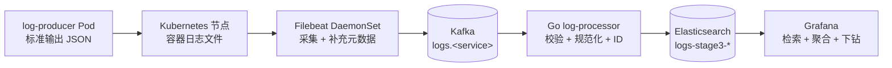

# 架构

- 状态：UC-001A 已验证基线
- 更新日期：2026-08-03
- 部署目标：WSL2 Minikube 的 `stage3-logs` 配置实例

## 1. 目标与约束

平台必须打通从 Kubernetes Pod 标准输出到可检索、可视化事件的日志链路，
同时将规模控制在单节点本地集群能够承载的范围内。

本基线保持以下不变量：

- UC-001 和 UC-002 是 `v0.1.0` 的必做用例。
- Kafka 将采集与处理解耦。
- Go `log-processor` 是 Kafka 到 Elasticsearch 的唯一业务处理路径。
- `v0.1.0` 中 Grafana 直接查询 Elasticsearch。
- 投递语义为至少一次；确定性 ID 使 Elasticsearch 写入具备幂等性。
- 所有清单都必须能从仓库复现。业务工作负载和数据必须限定在
  `stage3-logs` 中；任何必要的 Filebeat 宿主机访问或集群级只读权限
  都必须最小化、明确列出，并在验收前验证。

## 2. 系统上下文与核心链路

`api-service` 和 `worker-service` 使用同一个 `log-producer` 镜像。受控的 Pod
`service` 标签是服务身份和路由的权威来源，并通过 Downward API 注入
`PRODUCER_SERVICE_NAME`。`log-producer` 将其写入原始 `service.name`，
Filebeat 根据标签选择 `logs.api-service` 或 `logs.worker-service`，
`log-processor` 校验两者一致后把标签规范化为最终 `service.name`。未知或
缺失标签进入 `logs.unclassified`；已知标签与原始服务名不一致则进入
`logs.dlq`。

## 3. 组件职责

| 组件 | Kubernetes 形态 | 职责 | 不承担的职责 |
|---|---|---|---|
| `log-producer` | 两个持续 Deployment；固定批次验收另用 Job | 产生可预测、带编号的 JSON 日志 | Kafka 或 Elasticsearch 客户端 |
| Filebeat | DaemonSet | 节点日志采集、补充 Kubernetes 元数据、受控的主题路由 | 业务转换或直接写入 Elasticsearch |
| Kafka | 单节点 StatefulSet | 短时缓冲、按服务划分主题、提供重放边界 | 长期检索 |
| `log-processor` | Deployment | 消费、校验、规范化、生成 `event_id`、写入 Elasticsearch | 通用查询接口 |
| Elasticsearch | 单节点 StatefulSet | 索引、全文检索、按时间/服务/级别聚合 | 消息队列语义 |
| Grafana | Deployment | 检索界面、聚合面板、下钻 | 日志主存储 |

`log-producer` 表示应用日志来源，不是 Kafka Producer：它不引入 Kafka
客户端，只向标准输出写入 JSON；Filebeat 才负责将采集事件生产到 Kafka。
程序和镜像统一使用 `log-producer`，两个运行实例的业务身份仍为
`api-service`、`worker-service`。

`PRODUCER_COUNT` 为正数时生成固定批次，为 `0` 时持续到 SIGTERM。Deployment
使用持续模式，避免正常退出后被 `restartPolicy: Always` 反复拉起并重置序号；
精确 20 条的 UC-001A 验收使用一次性 Job。两种形态复用同一镜像和事件契约，
不在容器入口外包裹 `sleep`。持续模式收到取消信号后以退出码 0 结束；有限
批次若在完成前被取消则返回非零退出码，使 Job 能识别失败；当前验收策略不自动
重试。

验收 Job 使用独立 Kustomize overlay，不随持续 Deployment 部署。两个 Job
固定为单并发、单完成数、`backoffLimit=0` 和 `restartPolicy=Never`，避免失败
重试产生额外批次。运行入口为两个 Job 注入同一个当次唯一 `test_run_id`，依次
完成客户端资源集合校验、临时名称服务端 dry-run、旧终态 Job 的精确替换、
固定名称创建、等待和逐行 JSON 验证；正在运行的同名 Job 不会被替换。成功和
失败 Job 均保留到下一次执行，用于现场取证。

### 3.1 Go 可执行程序内部组织

`log-producer` 当前只有命令入口这一个调用方，因此代码先保留在
`cmd/log-producer` 的同一 Go 包内，但按职责拆分：

- `main.go`：程序入口、依赖组装、生命周期和退出错误；
- `config.go` 与 `config_test.go`：环境配置读取、默认值、校验及其测试；
- `producer.go` 与 `producer_test.go`：事件结构、日志生成和确定性输出测试。

这种组织避免入口文件承担业务行为，同时不为单一调用方提前增加包层次。只有
出现第二个真实调用方或稳定的共享领域边界后，才把对应行为提取到
`internal/`。

Prometheus、metrics-server 集成、HPA 和 Alertmanager 均推迟到
UC-001/UC-002 验收链路全绿之后。

## 4. Kubernetes 拓扑

- Minikube 配置实例：`stage3-logs`，Docker 驱动，containerd 运行时。
- 已验证的外层限制：4 CPU、6 GiB 内存。
- 应用命名空间：`stage3-logs`，使用 Pod Security Restricted enforce。
- 采集命名空间：`stage3-collector`，只放 Filebeat 等节点采集组件。
  Filebeat 所需 `hostPath` 不被 Baseline/Restricted enforce 允许，因此该命名
  空间使用 Privileged enforce，同时保留 Restricted warn/audit；不降低
  `stage3-logs` 的准入级别。
- 配置方式：Kustomize 基础配置加本地叠加配置（`base` + `overlay`）；
  不使用 Helm。
- 服务：基础设施默认使用 `ClusterIP`；本地界面访问使用临时
  `kubectl port-forward`。
- 有状态组件：Kafka 和 Elasticsearch 都使用单副本和开发级存储。
  这不是生产级高可用拓扑。
- Kafka 使用独立 `local-kafka` overlay 管理有状态生命周期，不随应用 Deployment
  隐式更新。普通 `kafka` Service 是客户端 bootstrap 入口；
  `kafka-headless` 为 `kafka-0` 提供稳定 Broker/Controller DNS，并发布未就绪
  地址以避免单节点控制器启动前的解析死锁。
- Kafka StatefulSet 使用固定 cluster ID、2 GiB `ReadWriteOnce` PVC 和 Retain
  删除/缩容策略。自动建主题关闭，主题初始化不耦合进 Broker 入口。
- 项目主题由独立 `local-kafka-topics` overlay 的一次性 Job 初始化。该 overlay
  只包含一个哈希 ConfigMap 和一个 Job，不包含 Broker、Service、Namespace 或
  PVC；因此重新执行主题管理不会隐式滚动 Kafka。固定名 Job 由宿主 runner 在
  校验用途标签和终态后精确重建，完成后保留最近证据。
- `log-processor`：配置就绪/存活探针、资源请求/限制、优雅终止，并以非根
  用户运行。
- `log-producer`：配置资源请求/限制、安全上下文和优雅终止。它没有 Service
  或流量入口，进程退出已由 kubelet 感知，因此不添加固定成功、`kill -0 1`
  或检查进程文件等无实际健康语义的探针；端到端日志到达由链路冒烟验证。
- 第三方镜像：只有在验证所选镜像行为后才收紧安全上下文；例外情况必须记录。
  Kafka 已验证以 UID/GID 1000、Restricted、只读根文件系统运行；官方入口所需
  `/opt/kafka/config`、`/tmp` 和数据目录分别由显式可写卷提供。初始化容器先把
  镜像原始配置复制到配置卷，避免格式化 JVM 启动时缺少 Log4j2 配置；主容器
  随后生成最终配置。两者使用同一镜像身份，并关闭 Service 环境变量自动注入，
  避免 `KAFKA_*` 名称污染 Broker 配置。
- 主题初始化 Job 与 Broker 共享固定 Kafka 镜像身份，但不共享生命周期、配置卷
  或数据 PVC。Job 不需要 Kubernetes RBAC，关闭 ServiceAccount token 和
  ServiceLinks，只挂载只读脚本和受限 `/tmp`，并使用 Restricted 安全上下文。
  Job 请求 50m CPU/128 MiB、限制 500m CPU/384 MiB，CLI 堆为 32～128 MiB；
  `activeDeadlineSeconds=180`、`backoffLimit=0`，宿主 runner 默认 300 秒超时用于
  等待终态并收集诊断，而不是给 Job 延长执行时间。
- Filebeat 只在 `stage3-collector` 只读挂载 `/var/log/containers` 与
  `/var/log/pods`，唯一宿主写路径为项目专用 registry
  `/var/lib/distributed-log-platform/filebeat-data`。稳定 `filestream` ID 和精确
  glob 只允许 `stage3-logs` 中容器名为 `log-producer` 的日志，不启用
  autodiscover、runtime socket 或整个 `/var/log` 挂载。
- Filebeat ServiceAccount 只通过 `stage3-logs` 中的 Role 获得 Pod
  `get/list/watch`，不使用 ClusterRole，也不能读取 Secret、节点、其他命名空间
  Pod 或执行写操作。节点日志实际为 `root:root 0640`，容器因此以 UID/GID 0
  读取，但仍为 `privileged=false`、禁止提权、丢弃全部 capability、只读根文件
  系统和 RuntimeDefault seccomp。
- Filebeat 固定调度到 linux/amd64，资源请求为 50m CPU/128 MiB，限制为
  500m CPU/256 MiB。实测 cgroup 当前内存约 46 MiB、启动峰值约 80 MiB。
  未启用 Filebeat 的技术预览 HTTP 指标端点，以免为形式化 probe 暴露内部指标；
  进程退出由 kubelet 重启，Kafka 投递能力由 Pod 内 output 检查和端到端消息验收
  证明。

完整技术栈必须在外层 4 CPU、6 GiB 限制内保留余量。`log-producer` 本地
开发基线已通过部署冒烟：每个 Pod 请求 10m CPU/16 MiB 内存，上限为
100m CPU/64 MiB 内存；一次稳定运行快照中 cgroup `memory.current` 约为
7.8 MB，两个 Pod 均无重启。该值只用于当前本地集群，不代表生产容量。
Kafka 和 Elasticsearch 使用小型开发堆内存、单副本和短保留期。Kafka 4.3.1
在 Kubernetes 中请求 250m CPU/768 MiB，限制为 1 CPU/1536 MiB，JVM 堆固定
512 MiB；一次稳定快照为 `memory.current=524591104` 字节、PID 119。实际 cgroup
为 1 CPU 和 1536 MiB，2 GiB PVC 已 Bound。该值是本地开发基线而非峰值、容量
结论或生产配置。

Kafka 的 startup/readiness 探针执行 Broker API 命令；liveness 使用 TCP 9092，
避免每 20 秒额外启动 JVM。TCP 只能证明端口仍监听，不能证明 Broker API 一定
有响应；该权衡只作为本地单节点基线，生产设计需使用更完整的健康信号。

## 5. 主题、索引与查询路径

### Kafka

| 主题 | 分区数 | 复制因子 | 用途 |
|---|---:|---:|---|
| `logs.api-service` | 3 | 1 | `api-service` 事件 |
| `logs.worker-service` | 3 | 1 | `worker-service` 事件 |
| `logs.unclassified` | 1 | 1 | 未知/缺失服务标签或 Kubernetes 元数据失效事件的固定兜底主题 |
| `logs.dlq` | 1 | 1 | 永久无效事件和处理证据 |

已知服务只有在标签与 Pod UID 都存在时才进入业务主题，并使用稳定的 Pod UID
作为分区键。严格路径允许列表命中但 `add_kubernetes_metadata` 未补齐 Pod UID 时
（例如旧 Pod 已从 API 消失或启动阶段缓存尚未命中），事件不被丢弃或伪造 Pod
UID，而是标记 `fields.routing_reason=kubernetes_metadata_missing`，使用
`sha256("|log.file.path|<path>|")` 的小写十六进制 Filebeat 指纹作为稳定 key，
并进入 `logs.unclassified`。未知标签不能
创建任意主题名。四个主题
都显式设置 `cleanup.policy=delete`、`retention.ms=86400000`、
`retention.bytes=134217728`、`segment.bytes=67108864` 和
`min.insync.replicas=1`。时间或容量条件任一满足即可淘汰旧段；
`retention.bytes` 是每分区限制。这些值只约束 2 GiB 开发 PVC，不能外推为生产
保留策略。

初始化采用“缺失则创建、存在则严格断言”。在任何创建前先检查全部已有主题；
分区、副本、ISR、重分配状态或显式配置不一致均失败，不自动扩分区、执行副本
重分配、修改保留期或删除主题。增加分区不可逆且会改变 keyed producer 的映射，
缩短保留期还可能删除数据，因此不能把这些操作隐藏在幂等入口中。

拓扑证据来自 `kafka-topics --describe`；显式配置证据来自 `kafka-configs`
逐行输出的 `DYNAMIC_TOPIC_CONFIG`，且动态键集合必须恰好为上述五项。不能解析
`kafka-topics` header 的 `Configs` 字段来证明 override：它会混入继承的有效值，
配置值中的逗号也没有转义，例如合法的 `cleanup.policy=delete,compact` 会造成
歧义。

这些主题数量和兜底路径已由 ADR-001/ADR-002 接受。业务主题从创建时起即为
多分区；消费者副本扩缩容实验本身仍然延期。

### Elasticsearch

- 索引模式：`logs-stage3-*`。
- `event_id` 用作 Elasticsearch 文档的 `_id`。
- `@timestamp` 和 `ingested_at` 使用日期类型。
- 服务、级别、命名空间、Pod UID、容器 ID 和测试批次字段在作为查询维度时
  使用精确匹配映射。
- `message` 支持全文检索。
- 索引模板和映射保存在仓库中。

Grafana 的明细、级别分布以及 ERROR/WARN 时间趋势使用同一个
Elasticsearch 数据源。`v0.1.0` 不增加 Go 查询服务。

## 6. 事件与投递契约

必需的事件字段和验收数据集定义在 `docs/requirements.md` 中。

投递和确认规则定义在
`docs/adr/ADR-002-delivery-and-idempotency.md` 中：

- Filebeat 投递与 Kafka 消费均为至少一次。
- 稳定的源字段生成确定性 `event_id`。
- Elasticsearch 使用该 ID 实现幂等创建。
- 只有在 Elasticsearch 写入成功、确认重复，或通过已接受的毒消息路径
  成功处理后，才确认 Kafka 处理进度。

## 7. 网络与安全边界

- Kafka、Elasticsearch 和 Grafana Service 均不对公网暴露。
- ConfigMap 只保存非敏感配置。
- 绝不提交真实凭据和通知目标。
- 如果为了适配隔离的本地集群而关闭 Elasticsearch 安全功能，清单和部署指南
  必须将该选择标注为仅限本地开发环境。
- 生产级 TLS、证书生命周期、多租户以及用户和基于角色的访问控制系统不在本版本范围内。

## 8. 版本矩阵与兼容性门禁

现在可以记录已验证的平台版本。应用镜像版本只有在相应的兼容性冒烟测试通过后
才能选定。

| 组件 | 版本状态 | 证据或门禁 |
|---|---|---|
| Go 工具链 | 已选定且本地验证：1.26.5 | `go version`；`go.mod` 和持续集成必须使用 Go 1.26.5 |
| Go 构建镜像 | 已验证：`golang:1.26.5-alpine@sha256:0178a641fbb4858c5f1b48e34bdaabe0350a330a1b1149aabd498d0699ff5fb2` | 多阶段构建成功；`CGO_ENABLED=0`、`trimpath`、禁用 VCS 元数据 |
| `log-producer` 运行基础镜像 | 已验证：`alpine:3.23@sha256:fd791d74b68913cbb027c6546007b3f0d3bc45125f797758156952bc2d6daf40` | UID/GID 10001、合法 JSON 输出和 SIGTERM 退出码 0 冒烟通过 |
| `log-producer` 应用镜像 | 本地构建已验证；仅允许 `dev` 或干净工作区的当前提交短 SHA，提交标签按流程不覆盖 | `make image IMAGE_TAG=<当前提交短 SHA>`；镜像约 4.75 MB，不使用 `latest` |
| Docker Engine | 本地已验证：29.6.2 | 客户端和服务端输出 |
| Minikube | 本地已验证：1.38.1 | `minikube version` / 配置实例证据 |
| Kubernetes | 集群已验证：v1.35.1 | `stage3-logs` 节点为 Ready |
| containerd | 集群已验证：2.2.1 | 节点运行时输出 |
| Kafka 镜像 | 已验证：`apache/kafka:4.3.1@sha256:77e3df9054047a88b520d0cc46e16696d3b22022e1d580aeccd2632df6532837` | 官方 JVM 镜像；linux/amd64 清单摘要 `sha256:ccd1314e47ec76909e01f86308b4dcf2064f19f7c89759234322314b0e319e26`；宿主与 Kubernetes 单节点 KRaft、Broker/初始化 Job 运行时 imageID、主题初始化幂等性、同一 PVC 上的主题元数据恢复及 Filebeat 集群内生产/消费通过；消息恢复尚未验证 |
| Filebeat 镜像 | 已验证：`docker.elastic.co/beats/filebeat-wolfi:9.4.4@sha256:e323c1c7c3bec7ea979cef3827f53ff2d576e1d3020e5d56cb9e40d6b49c48ca` | 上游 linux/amd64 manifest `sha256:3d14aa62612275ffae45891e523e9b29f23eb647032809190eb60f6b4a549379`；节点转换后 manifest/config 为 `sha256:a700abba5534b71456b1e6fb44c40f5ac7582ec1a9c2f458a672cbf98bea1eb9` / `sha256:fa7ab9fc5ce34d22947367ce44f7e4091cfca1fa3f39a2acfd97bceede6646bf`；Kafka 客户端协议固定为 Filebeat 支持的 `4.1.0` 并连接 Kafka 4.3.1；配置、运行时 imageID、正常路由和元数据失效兜底均通过 |
| Elasticsearch 镜像 | 待定 | 健康、模板、索引和查询冒烟测试通过后固定镜像标签和摘要 |
| Grafana 镜像 | 待定 | Elasticsearch 数据源和接口兼容性及预配置查询通过后固定 |
| Go Kafka 客户端 | 待定 | 仅在 Kafka 协议冒烟测试通过后选定，并记录理由 |
| Go Elasticsearch 客户端 | 待定 | 在 Elasticsearch 主版本确定后选定；客户端主版本必须匹配 |

“待定”不是可部署版本。任何清单都不得使用 `latest`。每个镜像选定后，
必须记录精确的镜像标签、摘要、来源文档和冒烟测试结果，才能替换“待定”。

Kafka 4.3.1 是 2026-06-25 发布的当前受支持修复版。项目使用 JVM 官方镜像，
不使用仍标记为实验性的 `apache/kafka-native`。本地冒烟采用默认的单节点
combined KRaft 模式，镜像内为非 root `appuser` 和 OpenJDK 21.0.11。官方来源为
[Apache Kafka 下载页](https://kafka.apache.org/community/downloads/)、
[4.3 Docker 指南](https://kafka.apache.org/43/getting-started/docker/)和
[KRaft 说明](https://kafka.apache.org/43/operations/kraft/)。combined 模式仅
用于本地开发验证，不代表控制器隔离、故障容忍或生产高可用。

本地 Docker→containerd 旁加载将 OCI manifest media type 转为 Docker v2，
使节点内 manifest 摘要变为
`sha256:f8f865a3222d807cf1e6c515ca447cb2fb604ddc57f0a007a02a9ce79bd7a511`。
自动比较确认它与上游 amd64 manifest 的 config digest
`sha256:47dccc76b32761bc57462b8753144cdbb73a16b123b1d13d3eedb92bb7952b11`
及全部 12 个 layer 摘要和大小一致；local overlay 使用固定 `4.3.1` 标签、
`Never` 拉取策略和四个摘要注解。注解仅保存证据；部署前门禁通过节点内
`ctr`/`crictl` 强制比较 manifest/config 摘要，滚动或主题初始化完成后再要求
Broker 主容器、Broker 初始化容器和主题初始化 Job 的 imageID 等于该 config
digest。

## 9. 验证层次

1. 静态/配置：Go 格式检查与 `vet`、Shell 语法、Kustomize 构建、一次性 Job
   资源边界与服务端准入、Filebeat 固定镜像配置正反例和十项 Kafka 校验器单测、
   Grafana 自动配置验证。
2. 单元：解析、必填字段、级别规范化、确定性 ID 和重试分类。
3. 集成：一条 Kafka 记录对应一个 Elasticsearch 文档；重复输入仍只产生
   一份唯一文档。
4. 端到端：Filebeat 按 Kafka 有界位点验证两个演示服务的唯一 `test_run_id`、
   Pod UID key、原始消息和主题隔离；元数据失效 fixture 验证未分类路径指纹。
   完整链路后续继续验证数据最终可在 Grafana 中查看。
5. 恢复：Kafka Broker Pod 替换后 Topic ID/拓扑/配置保持；Filebeat Pod 重建时
   registry 目录、`meta.json` 身份和 Beat UUID 保持，旧批次不回放且新批次完整
   到达。后续再验证 `log-processor` 重启、演示 Pod 替换和有界的 Kafka 不可用
   故障。
6. 性能：声明事件大小、速率和持续时间，并记录 p50/p95/p99、错误率和
   唯一文档数。

仅有“Pod 处于运行状态”、看似有效的 YAML 或能够打开的仪表盘，都不足以
作为验收证据。

## 10. 延期决策

- Kafka 的 TLS/SASL、多节点控制器隔离、生产容量与生产保留策略；Elastic 和
  Grafana 镜像的精确固定版本。
- Filebeat 的生产容量调优，以及 Elasticsearch、Grafana 和后续 Go 组件的精确
  堆内存、资源请求、资源限制和数据保留值。
- UC-003 告警、Prometheus、HPA 和多分区扩缩容实验。
- 生产级可用性、安全性和跨集群采集。

每个延期值都必须由对应用例解决，并由命令结果或 ADR 更新提供证据。
