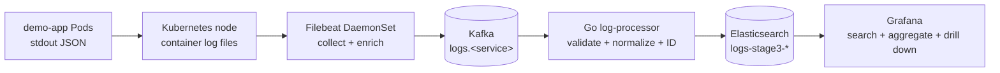

# Architecture

- Status: Day 1 baseline
- Updated: 2026-07-30
- Deployment target: WSL2 Minikube profile `stage3-logs`

## 1. Goals and constraints

The platform must close the log path from Kubernetes Pod stdout to searchable
and visualized events while remaining small enough for a single-node local
cluster.

The baseline preserves these invariants:

- UC-001 and UC-002 are mandatory for `v0.1.0`.
- Kafka separates collection from processing.
- Go `log-processor` is the only Kafka-to-Elasticsearch business path.
- Grafana queries Elasticsearch directly in `v0.1.0`.
- Delivery is at least once; deterministic IDs make Elasticsearch writes
  idempotent.
- All manifests must be reproducible from the repository. Business workloads
  and data must remain scoped to `stage3-logs`; any required Filebeat host
  access or cluster-level read-only RBAC must be minimized, listed explicitly
  and verified before acceptance.

## 2. System context and core flow

`demo-api` and `demo-worker` use the same `demo-app` image. A controlled Pod
`service` label selects `logs.demo-api` or `logs.demo-worker`; the normalized
event field is `service.name`.

## 3. Component responsibilities

| Component | Kubernetes form | Owns | Must not own |
|---|---|---|---|
| `demo-app` | Two Deployments | Predictable numbered JSON logs | Kafka or Elasticsearch clients |
| Filebeat | DaemonSet | Node log collection, Kubernetes enrichment, controlled topic routing | Business transformation or direct Elasticsearch writes |
| Kafka | Single-node StatefulSet | Short buffering, per-service topics, replay boundary | Long-term search |
| `log-processor` | Deployment | Consume, validate, normalize, derive `event_id`, write Elasticsearch | General query API |
| Elasticsearch | Single-node StatefulSet | Indexing, full-text search, time/service/level aggregation | Queue semantics |
| Grafana | Deployment | Search UI, aggregation panels, drill-down | Primary log storage |

Prometheus, metrics-server integration, HPA and Alertmanager are deferred until
the UC-001/UC-002 acceptance path is green.

## 4. Kubernetes topology

- Profile: `stage3-logs`, Docker driver, containerd runtime.
- Verified outer limit: 4 CPU and 6 GiB memory.
- Namespace: `stage3-logs`.
- Configuration: Kustomize base plus a local overlay; no Helm.
- Services: infrastructure defaults to `ClusterIP`; local UI access uses
  temporary `kubectl port-forward`.
- Stateful components: Kafka and Elasticsearch use one replica and development
  storage. This is not a production high-availability topology.
- `demo-app` and `log-processor`: readiness/liveness probes, resource
  requests/limits, graceful termination and non-root execution.
- Third-party images: security contexts are tightened only after the selected
  image behavior is verified; exceptions must be documented.
- Filebeat mounts only the required host log and registry paths, uses an
  allowlist for target workloads, and excludes its own and infrastructure logs.
- Filebeat may require hostPath access and cluster-level read-only metadata
  permissions; these are not permission to mutate resources outside the
  project namespace.

The complete stack must leave headroom inside the outer 4 CPU/6 GiB limit.
Kafka and Elasticsearch use small development heaps, single replicas and short
retention. Exact requests, limits and heap values are accepted only after a
component smoke test; they are not guessed in this baseline.

## 5. Topics, indexes and query path

### Kafka

| Topic | Partitions | Replication factor | Purpose |
|---|---:|---:|---|
| `logs.demo-api` | 3 | 1 | `demo-api` events |
| `logs.demo-worker` | 3 | 1 | `demo-worker` events |
| `logs.unclassified` | 1 | 1 | Fixed fallback for unknown or missing service labels |
| `logs.dlq` | 1 | 1 | Permanently invalid events and processing evidence |

The partition key is the stable Pod UID for known services. Unknown labels
cannot create arbitrary topic names. Initial retention is short and local-only;
the exact duration is pinned with the Kafka manifest after its compatibility
smoke test.

These topic counts and fallback paths are accepted by ADR-001/ADR-002. The
topics are multi-partition from creation; the consumer replica-scaling
experiment itself remains deferred.

### Elasticsearch

- Index pattern: `logs-stage3-*`.
- `event_id` is the document `_id`.
- `@timestamp` and `ingested_at` are dates.
- Service, level, namespace, Pod UID, container ID and test-run fields use
  exact-match mappings where queried as dimensions.
- `message` is full-text searchable.
- Index templates and mappings live in the repository.

Grafana uses the same Elasticsearch data source for details, level distribution
and ERROR/WARN time trends. `v0.1.0` does not add a Go query service.

## 6. Event and delivery contracts

The required event fields and acceptance datasets are defined in
`docs/requirements.md`.

Delivery and acknowledgement rules are defined in
`docs/adr/ADR-002-delivery-and-idempotency.md`:

- Filebeat and Kafka consumption are at least once.
- Stable source fields produce a deterministic `event_id`.
- Elasticsearch uses that ID for idempotent creation.
- Kafka progress is acknowledged only after Elasticsearch success, confirmed
  duplicate, or successful handling by the accepted poison-message path.

## 7. Network and security boundary

- No Kafka, Elasticsearch or Grafana Service is exposed publicly.
- ConfigMaps hold non-sensitive configuration only.
- Real credentials and notification destinations are never committed.
- If Elasticsearch security is disabled to fit the isolated local cluster, the
  manifest and deployment guide must label that choice as local development
  only.
- Production TLS, certificate lifecycle, multi-tenancy and user/RBAC systems
  are outside this release.

## 8. Version matrix and compatibility gate

Verified platform versions may be recorded now. Application image versions stay
unselected until the corresponding compatibility smoke test passes.

| Component | Version state | Evidence or gate |
|---|---|---|
| Go toolchain | Local tool verified: 1.26.5; module minimum target planned: 1.22 | `go version`; Go 1.22 compatibility remains unverified until CI/build runs it |
| Docker Engine | Verified locally: 29.6.2 | Client and server output |
| Minikube | Verified locally: 1.38.1 | `minikube version` / profile evidence |
| Kubernetes | Verified cluster: v1.35.1 | Ready `stage3-logs` node |
| containerd | Verified cluster: 2.2.1 | Node runtime output |
| Kafka image | `TBD` | Pin tag and digest after single-node produce/consume smoke |
| Filebeat image | `TBD` | Pass Filebeat→Kafka config/output checks and preserve the required real-event fields |
| Elasticsearch image | `TBD` | Pin tag and digest after health, template, index and query smoke |
| Grafana image | `TBD` | Pin after its Elasticsearch data-source/API compatibility and provisioned query pass |
| Go Kafka client | `TBD` | Select only after Kafka protocol smoke and record rationale |
| Go Elasticsearch client | `TBD` | Select after Elasticsearch major; client major must align |

`TBD` is not a deployable version. No manifest may use `latest`. For each
selected image, record the exact tag, digest, source documentation and smoke
result before replacing `TBD`.

## 9. Verification layers

1. Static/config: Go formatting and vet, Kustomize build, Filebeat config/output
   checks, Grafana provisioning validation.
2. Unit: parsing, required fields, level normalization, deterministic ID and
   retry classification.
3. Integration: Kafka record to one Elasticsearch document; duplicate input to
   one unique document.
4. E2E: fixed `test_run_id` from both demo services through Grafana-visible
   data.
5. Recovery: processor restart, demo Pod replacement and bounded Kafka outage.
6. Performance: declared event size/rate/duration with p50/p95/p99, error rate
   and unique-document counts.

`Pod Running`, valid-looking YAML or an open dashboard is not sufficient
acceptance evidence.

## 10. Deferred decisions

- Exact Kafka, Elastic and Grafana image pins.
- Exact heap, requests, limits and data-retention values.
- UC-003 alerting, Prometheus, HPA and multi-partition scaling experiments.
- Production-grade availability, security and cross-cluster collection.

Each deferred value must be resolved by the relevant use case and backed by a
command result or ADR update.
